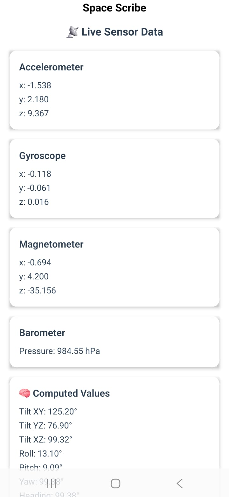
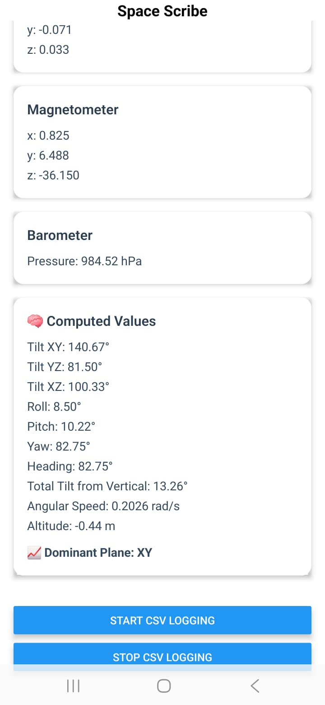
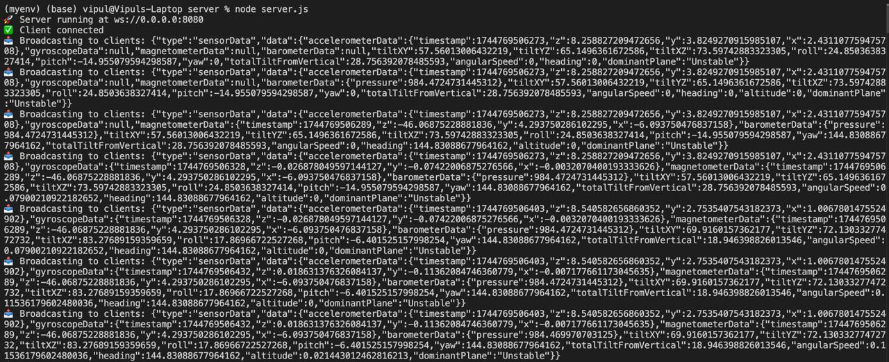
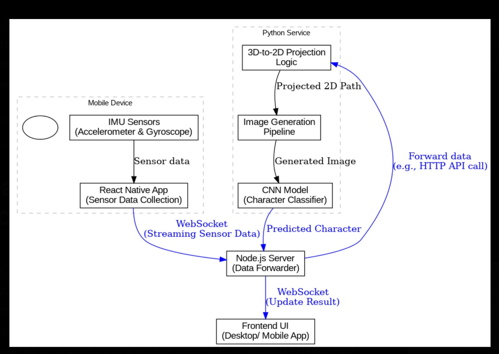
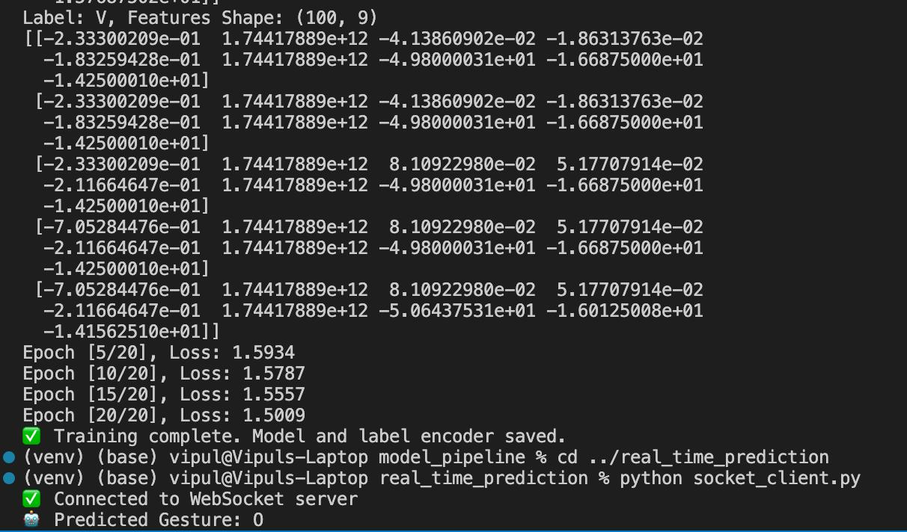

# 🚀 SpaceScrible

**SpaceScrible** is a cross-platform real-time motion tracking app. It captures **sensor data** (gyroscope + accelerometer) from a mobile device, streams it to a Node.js backend, which then forwards it to a Python service for alphabet recognition. The predicted alphabet is then displayed on a desktop AI interface.

> 📱 Mobile (React Native) → 🌐 Node WebSocket Server → 🐍 Python Service (Gesture Recognition) → 🖥️ Desktop Client (Swift/macOS - AI Display)

 
*This image showcases the live sensor data being captured by the mobile app, including accelerometer, gyroscope, magnetometer, and barometer readings.*
 

 
*Here you can see the computed values derived from the raw sensor data, such as tilt angles, roll, pitch, yaw, and heading, providing a more intuitive understanding of the device's orientation and motion.*
 
 

*This log output demonstrates the Node.js server receiving a continuous stream of sensor data from connected mobile devices, confirming the real-time data transmission pipeline.*
 

*This diagram illustrates the overall architecture of SpaceScrible, highlighting the flow of sensor data from the mobile app through the Node.js server to the Python gesture recognition service and finally to the desktop AI display.*
 

*This shows the Python service in action, including the training process of the machine learning model for gesture recognition and a prediction of the recognized alphabet.*
 

---

## ✨ Features

- 📲 Capture real-time gyroscope & accelerometer data from mobile sensors
- 🔁 Stream sensor data to a connected Node.js server via WebSocket
- 🧠 **New:** Python service analyzes sensor data to predict alphabets.
- 🖥️ Swift desktop app to visualize incoming sensor events and display the recognized alphabet.
- 🌐 Communication between backend and Python service.
- 🧠 Modular, layered folder structure for clean separation
- ✅ Built with production best practices

---

## 📁 Folder Structure

\`\`\`
SpaceScrible/
├── .gitignore
├── README.md
├── mobile/           # React Native Mobile App (TypeScript)
│   ├── android/
│   ├── ios/
│   ├── src/
│   ├── vendor/
│   ├── .eslintrc.js
│   ├── .gitattributes
│   ├── .gitignore
│   ├── .prettierrc.js
│   ├── .watchmanconfig
│   ├── app.json
│   ├── App.tsx
│   ├── babel.config.js
│   ├── Gemfile
│   ├── Gemfile.lock
│   ├── index.js
│   ├── jest.config.js
│   ├── metro.config.js
│   ├── package-lock.json
│   ├── package.json
│   ├── README.md
│   └── tsconfig.json
│
├── server/     # Node.js WebSocket Server
│   ├── controllers/
│   ├── data/
│   ├── models/
│   ├── routes/
│   ├── package-lock.json
│   ├── package.json
│   ├── server.js
│   └── .gitignore
│   └── README.md
│
├── desktop/          # macOS Swift App (Xcode Project)
│   ├── Controller/
│   ├── Model/
│   ├── View/
│   ├── WebSocketManager.swift
│   └── SpaceScribIe.xcodeproj
│
└── gesture_recognition/ # Python Service for Gesture Recognition
    ├── # (Your Python scripts, models, etc. will be here)
    ├── Create/
    ├── environment/
    ├── interactive_learning/
    ├── model_pipeline/
    ├── myenv/
    ├── path/
    ├── real_time_prediction/
    ├── source/
    ├── venv/
    └── virtual/
\`\`\`

---

## ⚙️ Getting Started

### ✅ Prerequisites

- Node.js + npm
- Xcode (for Swift/macOS app)
- React Native CLI + Android/iOS simulator
- **Python and necessary libraries (e.g., TensorFlow, PyTorch, etc. - as required by your `gesture_recognition` service)**
- All devices connected to the same local network (for WebSocket communication)

---

### 🧱 1. Start the WebSocket Server (Node.js)

\`\`\`bash
cd SpaceScribeServer
npm install
node server.js
\`\`\`

> By default, the server runs on \`ws://<your-local-ip>:8080\`.
> Use \`ifconfig\` or \`ipconfig\` to get the IP to plug into your client apps.

---

### 🐍 2. Start the Python Gesture Recognition Service

\`\`\`bash
cd gesture_recognition
# Activate your Python environment (if applicable)
# source venv/bin/activate  # Example for a virtual environment
python your_main_script.py  # Replace with the actual name of your main Python script
\`\`\`

> Note the port or communication method your Python service uses. You might need to configure the Node.js server to communicate with it.

---

### 📱 3. Run the React Native Mobile App

\`\`\`bash
cd ../SpaceScribe
npm install
npx react-native run-ios     # or: run-android
\`\`\`

**Update \`WebSocketService.ts\` with the correct IP of the Node.js server:**

\`\`\`ts
const socket = new WebSocket('ws://192.168.x.x:8080');
\`\`\`

---

### 💻 4. Run the macOS Swift App (Desktop)

1. Open \`SpaceScribIe.xcodeproj\` in Xcode
2. Build and run the project
3. Ensure \`WebSocketManager.swift\` is using the **same IP and port** as the Node.js server. The desktop app will now receive the predicted alphabet from the server.

---

## 🧪 How It Works

- The React Native app reads gyroscope & accelerometer values.
- It sends this data every \`x\` milliseconds to the Node.js WebSocket server.
- The Node.js server receives the sensor data and **forwards it to the Python `gesture_recognition` service.**
- **The Python service analyzes the incoming sensor data using your machine learning models to predict the alphabet being drawn.**
- **The predicted alphabet is then sent back to the Node.js server.**
- The macOS app connects to the Node.js server and listens for incoming data, **now including the predicted alphabet, which is displayed on the AI interface.**

---

## 🛠️ Tech Stack

| Platform       | Tech                            |
|----------------|---------------------------------|
| Backend        | Node.js, WebSocket              |
| **AI Service** | **Python, (TensorFlow/PyTorch/etc.)** |
| Mobile         | React Native, TypeScript        |
| Desktop/macOS  | Swift, URLSessionWebSocketTask  |
| Protocol       | WebSocket (potentially others for Node.js <-> Python) |

---

## 💡 Future Ideas

- Enhance the alphabet recognition accuracy and supported characters.
- Visualize the motion trail or confidence levels of the predictions on the desktop AI.
- Implement user feedback mechanisms to improve the model.
- Explore different machine learning models and techniques.
- Store session data, including predictions.

---

## 🤝 Contribution

Contributions are welcome! Feel free to open an issue or pull request.

\`\`\`bash
git clone https://github.com/bchikara/SpaceScrible.git
\`\`\`